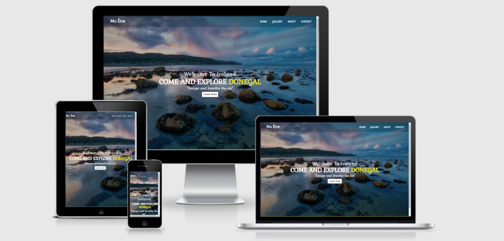

# ***[Travel to Ireland](https://jincy09.github.io/Travel_to_Ireland/index.html)***

  
   
---   
  
# Project Description
**Code Institute: User-Centric Front-End Development**  
  
* I have decided to create a website for a fictional tour here in Ireland.  
However, while the tour is fictional the places featured are real and
this was an idea that I had brought forward for the promotion of tourism in Ireland. 
While the Covid-19 Pandemic has devastated people across the globe; it is hoped that
we will be able to travel all around the world. Meanwhile, I have created this website
to give little idea about the places, so that ones everything comes to normal an option 
for travel would be this country.  
  
* For the purpose of my Milestone 1 project we're going to see attractive places, music ,culture and tour.
  
* On that basis I have used the five planes of UX methodology to identify the user needs, the features required, the most logical way to structure the information and the functionality required for this Milestone project.
  
---    
      
# Content

- [Project Description](#project-description)
- [Contents](#contents)
- [UX Design](#ux-design)
  * [Strategy](#strategy)
    + [User Stories:](#user-stories-)
      - [First Time Visitor Goals](#first-time-visitor-goals)
      - [Returning & Frequent Visitor Goals](#returning-visitor-goals)
- [Scope](#scope)
  * [Functional Specification](#functional-specification)
    + [Current requirements:](#current-feature-requirements-)
    + [Content Requirements:](#content-requirements-)
- [Features:](#features-)
    + [Home.html](index.html)
    + [Gallery.html](gallery.html)
    + [Contact.html](contact.html)
    + [About.html](about.html)
- [Structure](#structure)
  * [Information Design  (IA)](#information-design---ia-)
  * [5. wireframes](#5-wireframes)
  * [6. Visual Design](#6-visual-design)
- [Technologies Used](#technologies-used)
  * [Languages Used](#languages-used)
    + [Frameworks, Libraries & Programs Used](#frameworks--libraries---programs-used)
- [TESTING](#testing)
- [Deployment](#deployment)
  * [GitHub Pages](#github-pages)
  * [Forking the GitHub Repository](#forking-the-github-repository)
  * [Making a Local Clone](#making-a-local-clone)
- [Credits](#credits)
  * [Media](#media)
  * [Research for choice of Colour palette:](#research-for-choice-of-colour-palette-)
  * [Tourism websites from which I took inspiration when planning my project:](#tourism-websites-from-which-i-took-inspiration-when-planning-my-project-)
- [Acknowledgements](#acknowledgements)


### User Stories :  
    
The user is looking to explore different places,culture,cuisines when they come to Ireland. They want to sit back and enjoy the mesmerising beauty which Ireland gives.  They are interested in seeing some of the history of Ireland's Ancient  but they enjoy sampling quality local food.  

* First Time Visitors Goals

       1. As a First Time Visitor, I want to easily see the details of the tour.
       2. As a First Time Visitor, I want to be able to navigate the site easily with the minimum number of clicks to get to the desired information.
       3. As a First Time Visitor, I want to easily see the options available to customise the tour.
       4. As a First Time Visitor, I want to interact with people around the world about the beautiful places in Ireland. So that we can connect with different people from different cultures
       5. As a First Time Visitor, I want to give amazing stories of different places just at your finger tips. So that even during COVID19, it will be easy for people around the world to explore beautiful places when sitting at home.
       6. As a First Time Visitor, I want to be able to go through the site and to give a clear idea about the page.

* Returning Visitor Goals

       1. As a Returning Visitor, I want to update the pictures regularly. So that the viewers can enjoy and update their knowledge about different Jaw-dropping natural landscapes, regal castles, Irish locals, lively cities, rich heritage, delicious food.
       2. As a Returning Visitor, I want to welcome people around the world to visit and enjoy the benefits of Ireland.
       3. As a Returning Visitors, I want to be able to solve the queries of the visitors through email, so that I will be able to give a clear idea about the places.
       4. As a Returning Visitor, I want to provide freedom and flexibility to the visitors, so that virtual trips can bring leisure to the visitors at their preferred time schedule.
       5. As a Returning Visitor, I want to preserve the information, so that ones the viwers come back the relevant information is safe.

* Issues For Users To Overcome


       1. To provide adequate information about the different places showcased.
       2. To provide tour guide for free of cost and a feeling of actually being there.
       3. To structre the designs in a way so that it would be easy to navigate for viewers.
       4. To adapt Responsive Web Designs, so that it can be used in all devices.
       
     
* Future Ideas


       1. Implement video experience for the viewers, to give a 3D effect on view.
       2. Initiate a blog/RSS for the viewers, to keep them up-to-date.

[Back to Content](#content)  

---  

# Scope :  

## Functional Specification  

### Current requirements:     
* A responsive website that will  adapt for mobile, tablet and laptop devices
* A navigation bar that will be fixed to the top of the screen for the easy visibility.  
* A unique home page that will visually communicate the content contained within the page.
* A page that will clearly display the full tour itinerary.
* A page that will allow the user to extend their wish to explore Ireland.
* A gallery page to visually attract people with full explanation, so that they wont have any doubt in their mind
* A Contact Us page that will contain a  form to enable the user to submit their views about Ireland.
* A about page which gives the description of page and of Ireland

  
### Content Requirements:    
* The overview of different places, culture and the routine followed in Ireland.  
* A tag with link to entice the user to explore the whole Ireland in nutshell.  
* A tag with link to entice the user to explore the full list of image gallery to visually enjoy the quality of different places with explanation.  
* A contact form so that we can stay in contact with the user and work on building their trust until they know about Ireland.
* Social media links to help and explain about Ireland, to stay connected with the users with different views and explaination .   
* The tour inclusions
 [Back to Content](#content)  

# Features:
* All the four pages consists of  navigation menu bar on top where you can click to go to any of the four pages 
  wherever you are on the current page. The four pages also consist of the same footer with four social
  links taking them to a new tab with the relevant social media for more details.
* I chose a stylish font called 'Gabriela' for attractive fonts which is eye catching fonts for the users.
* The font colours displayed mainly are white, skyblue, silver and black for homepage,
gallery  background colours for nav in navy blue: rgb(5, 37, 78);, button colours in white and yellow and social links for all pages 
 in yellow: rgb(185, 185, 9) to link the travel to Ireland website.

## [home.html](https://github.com/Jincy09/Travel_to_Ireland/blob/main/index.html)
* This page has a background  image of a beautiful place helping the user to enjoy the natural, inspiring the user to add Ireland to their bucketlist to travel. The name of the website ‘Travel to Ireland’ is displayed, and has given a brief description in the ‘About Us’ section.
* This page has a gallery, about us page, learn more and a contact page.
* The home page also has a beautiful styling which shows diferent places in one go. 
* the page at the bottom is a neat row of social links consisting of Facebook, Instagram, Youtube and google.

## [gallery.html](https://github.com/Jincy09/Travel_to_Ireland/tree/main/gallery)

* This page has different images of different places, activities, music, culture and food.
* This page shows the image in beautiful card format which makes the users easy to get to know about the places.
* This page is also has an easy navigation to different pages.
* This page also has a logo Mo Éire(which means my Ireland) which is the heart of this page.

## [learnmore.html](https://github.com/Jincy09/Travel_to_Ireland/blob/main/learnmore.html)

* This page has a beautiful video background of Cliff Of Moher which gives the users to enjoy the serinity of the cliff from aerial view.
* This page gives a brief description of Ireland, about the population, geagraphical location and residents.
* This page leads to the gallery which describes in details. 

## [contact.html](https://github.com/Jincy09/Travel_to_Ireland/blob/main/contact.html)
* This is is a simple page with hero image of a landscape with the same heading and to keep the style consistent.
* In this page, it has form which includes name, number and email address.

## [about.html](https://github.com/Jincy09/Travel_to_Ireland/blob/main/about.html)
* This page gives the brief description about the purpose of creating this page with a beautiful background to make it more attractive.

# TESTING  

The entire testing process, issues and bugs found during development, solutions are [here]().

- Bugs and Issues
- Validatiors
- User stories

# Structure :

# wireframes :

I used [Balsamiq](https://balsamiq.com/) to create
[wireframes](https://github.com/Jincy09/Travel_to_Ireland/tree/main/wireframes) in desktop, tablet and phone view.


# Technologies Used  

## Languages Used

-  [HTML5](https://en.wikipedia.org/wiki/HTML5)

-  [CSS3](https://en.wikipedia.org/wiki/Cascading_Style_Sheets)


### Frameworks, Libraries & Programs Used

* [__Bootstrap 4.1.3__](https://getbootstrap.com/docs/4.1/getting-started/introduction/) Bootstrap Grid was used for responsiveness as well as features such as Collapse, Carousel & Forms..
* [__Balsamiq__](https://balsamiq.com) Balsamiq was used to create wireframes during the design process.
* [__Google Fonts__](https://fonts.google.com) used for project fonts.
* [__Gitpod__](https://gitpod.io) Gitpod was the IDE used to create the site and for version control.
* [__Github__](https://github.com/) GitHub is used to store the projects code after being pushed from Gitpod.
* [__Fontawesome__](https://fontawesome.com) Font Awesome was used for the Icons throughout the site.
* Google DevTools used for debugging and testing.
* [__W3Scool__](https://www.w3schools.com/) used as a general source of information.
* [__Unsplash__](https://unsplash.com/) used to download images for the website.
* [__W3C Markup Validator__](https://validator.w3.org/) Used to test HTML code validation.
* [__W3C CSS Validatior - Jigsaw__](https://jigsaw.w3.org/css-validator/) Used to test CSS code validation.
* [__Am I Responsive__](http://ami.responsivedesign.is/) used to create Mock-up images to represent the site's responsiveness.
  
[Back to Content](#content)  

--- 


# Deployment

## GitHub Pages

This project was deployed to GitHub Pages following these steps:

1. Login to GitHub  
2. Locate the following GitHub Repository name in the Search Bar: Jincy09/Travel_to_Ireland  [See Visual Aid](https://github.com/Jincy09/Travel_to_Ireland/blob/main/README.md)  
3. Click into the repository to view more details
4. Click on Settings, located on the menu tab just below the repository name  [See Visual Aid](https://github.com/Jincy09/Travel_to_Ireland) 
5. Scroll down to the GitHub Pages section
6. Under Source, select Master in the dropdown menu  [See Visual Aid](https://github.com/Jincy09/Travel_to_Ireland/settings)  
7. Select /(root) in the tab that is next to Branch selector  [See Visual Aid](https://github.com/Jincy09/Travel_to_Ireland/settings/pages)    
8. Click Save and page will automatically refresh
9. Scroll back down again to the GitHub Pages section
10. You will now see a link to the deployed website  [See Visual Aid](https://github.com/Jincy09/Travel_to_Ireland/settings/pages)  
11. To view the deployed website [click here!](https://jincy09.github.io/Travel_to_Ireland/)  

## Forking the GitHub Repository

By forking the GitHub Repository you make a copy of the original repository on your own GitHub account to view and/or make changes without affecting the original repository by following these simple steps:

1. Log in to GitHub and locate the [ Jincy09/Travel_to_Ireland Repository](https://github.com/Jincy09/Travel_to_Ireland)
2. Near the top of the Repository, on the right-hand side of the screen, locate the "Fork" button.
3. Click this button and you should now have a copy of the original repository in your GitHub account.
  
## Making a Local Clone

1. Log in to GitHub and locate the [ Jincy09/Travel_to_Ireland Repository](https://github.com/Jincy09/Travel_to_Ireland)
2. Under the repository name, click "Clone or download".
3. To clone the repository using HTTPS, under "Clone with HTTPS", copy the link.
4. Open Git Bash
5. Change the current working directory to the location where you want the cloned directory to be made.
6. Type `git clone`, and then paste the URL you copied in Step 3.
```
$ git clone https://github.com/Jincy09/Travel_to_Ireland
```
7. Press Enter. Your local clone will be created.
```
$ git clone https://github.com/Jincy09/Travel_to_Ireland
> Cloning into `CI-Clone`...
```  
  [Back to Content](#content)  

  ---

# Credits
  
## Media   
  
Images used on index.html:  
-  [Hero Image for index.html](https://brontebabeblog.files.wordpress.com/2019/08/pexels-photo-1650906.jpeg?w=1024&h=363&crop=1)  Taken from pixel.com

   
     
Images used in Gallery:    
-  [Areal view of powerscourt](https://www.instagram.com/p/CNfCZ4pIauN/) Taken from Instagram   
-  [Autumn Dublin](https://www.instagram.com/lovindublin/) Taken from Instagram-lovin dublin 
-  [Bray](https://www.theirishroadtrip.com/bray-to-greystones-cliff-walk/) Taken from Irish road trip.  
-  [Ha penny bridge](https://www.reddit.com/r/ireland/comments/abxmsm/hapenny_bridge/)  Taken from Redit.com  
-  [Dublin street Music](https://pxhere.com/en/photo/101282?hcb=1) take from pixhere.com
-  [Annes lane](https://www.alamy.com/stock-photo-dublinireland-03192018-umbrellas-on-annes-lane-dublin-ireland-close-177623492.html) Taken from alamy
-  [Donegal](https://fitfunadventures.com/exploring-the-mountains-cliffs-and-beaches-of-south-west-donegal/) Taken from Fitfun adventures
-  [Kerry](https://www.reddit.com/r/ireland/comments/8thayr/ive_never_seen_carantouhill_pictured_so_well/) Taken from Redit
-  [Dublin Bus](https://unsplash.com/photos/qwFqw0EVyuM) Taken fron unsplash
-  [Irish doors](https://www.alamy.com/two-vintage-georgian-doors-in-yellow-and-blue-in-dublin-image335638663.html) Taken from alamy
-  [Galway homes](https://unsplash.com/photos/UR-9hOEW-Ww) Taken from unsplash
-  [Artists in Ireland](https://www.instagram.com/p/CNxla7wqbmE/) Taken from Instagram
-  [Lighthouse in Ireland](https://www.instagram.com/p/CLw9cF9qmiH/) Taken from Instagram
-  [Winters in Ireland](https://www.instagram.com/p/CLEO91-qKHz/) Taken from Instagram
-  [Puffins in Ireland](https://unsplash.com/photos/4AmyOdXZAQc) Taken from unsplash
-  [Streets of Ireland](https://unsplash.com/photos/POQHijPTjIA) Taken from unsplash
-  [Bakery in Ireland](https://unsplash.com/photos/HOf7YHJCMTM) Taken from unsplash
-  [Irish Cuisines](https://unsplash.com/photos/14HKCEgadoU) Taken from unsplash
-  [People In Ireland](https://unsplash.com/photos/QV5OUQEgXXw) Taken from unsplash
-  [Luas](https://unsplash.com/photos/NBsJsj8JFpM) Taken from unsplash
-  [Gardens in Ireland](https://www.pinterest.ie/pin/690458186601069555/) Taken from pinterest
-  [Shopping centres in Ireland](https://www.alamy.com/clock-st-stephens-green-shopping-centre-dublin-ireland-image7274575.html) Taken from alamy
-  [Dublin city](https://www.facebook.com/LovinDublin/photos/a.137889432904502/2500219036671518/?type=3&hc_ref=ARQP43zcSVn7MxYYZLl3c_bvtFYWhXn91jhRMvqcNL2YbJDyJumR2RdZNR-3WUY53ps) Taken from facebook
-  [Spring in Ireland](https://www.shutterstock.com/search/herbert+park) Taken from shutterstock
-  [Dockland](https://unsplash.com/photos/topW4GzqygI) Taken from unsplash


Images used in About.html:

-  [Background video](https://www.youtube.com/watch?v=aw467fHB_ko&t=52s) Taken from Youtube


Image used on contact.html:  
-  [contact](https://shoptr.shopsadgr.com/category?name=manzaral%C4%B1%20duvar%20tablolar%C4%B1)  Taken from boxinghq
  


## Research for choice of Colour palette:      
-  [Adobe](https://color.adobe.com/create/color-wheel)  
    
## Websites from which I took inspiration when planning my project:  
-  [Irish Spirit Tours](https://stephenj2020.github.io/CI-MS1-IrishSpiritTours/index.html)  
-  [Avalanche Cafe](https://dori78.github.io/AvaLanche/)    
-  [Ireland](https://www.ireland.com/en-gb/)  
-  [South Coast SUP](https://timmorrisdev.github.io/south-coast-sup/index.html)   
  
[Back to Content](#content)  

---  
   
# Acknowledgements     

I would like to thank the following people for their support and guidance during this project:    
- My Mentor  Precious Ijege.    
- The Code Institute Slack Community.  
- My husband Mithun for all his valuable feedback on my project and believing in me.  

[Back to Content](#content)   


