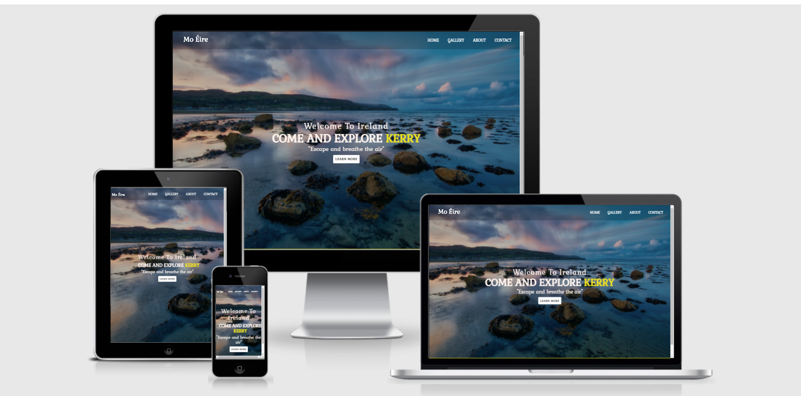

# ***[Travel to Ireland](https://jincy09.github.io/Travel_to_Ireland/index.html)***

  
   
---   
  
# Project Description   
**Code Institute: User-Centric Front-End Development**  
  
The Milestone 1 project assignment is to build a static front-end website using the technologies that we have learned so far on the Code Institute course. I have the option to choose from one of the following three scenarios or to come up with my own idea:  
. Build a website for a band (real or fictional)  
. Build a website for a gym  
. Build a personal portfolio site ( potentially for yourself) 
   
I have decided to create a website for a fictional tour company here in Ireland.  However, while the tour company is fictional the places featured are real and this was an idea that I had brought forward in September 2019 to the Celbridge Tourism and Heritage Forum, of which I'm a voluntary member. Over the last 5 years this voluntary community group has sought funding to produce [Celbridge Tourism and Heritage Strategy (2016-2020)](http://www.kildarelcdc.ie/wp-content/uploads/2012/07/Celbridge-Gateway-to-Irelands-AE-Tourism-Heritage-Strategy-May-2016.pdf), [Celbridge Heritage Trail Audio Guide](http://www.abartaheritage.ie/product/celbridge-heritage-trail-audio-guide/) and [The Discover Celbridge website](http://www.discovercelbridge.com/). While the group have not met since the end of 2019 and our activities have been suspended due to the Covid-19 Pandemic and the devastating effects it continues to have across the globe; it is hoped that we will be able to resume our work on future projects in late 2021 or early 2022.  
  
The idea for this tour came from the fact that the town of Celbridge, in Co. Kildare, has many historic and cultural sites that would appeal to the domestic and international tourism market, but also the realisation that our offering isn't yet developed enough to be able to  market Celbridge as a stand-alone tourist destination.  Therefore, my idea was to identify other community groups in neighbouring counties who are also working to promote their local area and to collaborate to create a ready-made tour itinerary featuring each of our localities and to then pitch it at a number of local tour companies for one of them to take on and operate.  The idea is not for any of the community groups or the individuals involved with them to directly benefit from this project. Rather the objective is for our wider communities to benefit from the impact that increased tourism will lead to i.e. the creation of local employment opportunities as well as increased private and public sector investment into improved facilities in these localities.  
  
For the purpose of my Milestone 1 project we're going to assume that the final tour itinerary has been agreed and that the fictional family run tour operator, Irish Spirit Tours, has undertaken to incorporate this itinerary into their business as a means of expanding their current product offering.  
  
On that basis I have used the five planes of UX methodology to identify the user needs, the features required, the most logical way to structure the information and the functionality required in order to produce a wireframe that will form the blueprint for this Milestone project.
  
---    
      
# Content

- [Project Description](#project-description)
- [Contents](#contents)
- [UX Design](#ux-design)
  * [Strategy](#strategy)
    + [User Stories:](#user-stories-)
      - [First Time Visitor Goals](#first-time-visitor-goals)
      - [Returning & Frequent Visitor Goals](#returning-visitor-goals)
    + [User personas](#user-personas)
    + [The Business Scenario](#the-business-scenario)
- [Scope](#scope)
  * [Functional Specification](#functional-specification)
    + [Current feature requirements:](#current-feature-requirements-)
    + [Future feature requirements:](#future-feature-requirements-)
    + [Content Requirements:](#content-requirements-)
- [Structure](#structure)
  * [Information Design  (IA)](#information-design---ia-)
  * [5. wireframes](#5-wireframes)
  * [6. Visual Design](#6-visual-design)
- [Technologies Used](#technologies-used)
  * [Languages Used](#languages-used)
    + [Frameworks, Libraries & Programs Used](#frameworks--libraries---programs-used)
- [TESTING](#testing)
- [Deployment](#deployment)
  * [GitHub Pages](#github-pages)
  * [Forking the GitHub Repository](#forking-the-github-repository)
  * [Making a Local Clone](#making-a-local-clone)
- [Credits](#credits)
  * [Media](#media)
  * [Research for choice of Colour palette:](#research-for-choice-of-colour-palette-)
  * [Tourism websites from which I took inspiration when planning my project:](#tourism-websites-from-which-i-took-inspiration-when-planning-my-project-)
- [Acknowledgements](#acknowledgements)

### User Stories:  
    
The user is looking to explore different places,culture,cuisines when they come to Ireland. They want to sit back and enjoy the mesmerising beauty which Ireland gives.  They are interested in seeing some of the history of Ireland's Ancient  but they enjoy sampling quality local food.  

     - #### First Time Visitors Goals
       1. As a First Time Visitor, I want to easily see the details of the tour.
       2. As a First Time Visitor, I want to be able to navigate the site easily with the minimum number of clicks to get to the desired information.
       3. As a First Time Visitor, I want to easily see the options available to customise the tour.
       4. As a First Time Visitor, I want to interact with people around the world about the beautiful places in Ireland. So that we can connect with different people from different cultures
       5. As a First Time Visitor, I want to give amazing stories of different places just at your finger tips. So that even during COVID19, it will be easy for people around the world to explore beautiful places when sitting at home.
       6. As a First Time Visitor, I want to be able to go through the site and to give a clear idea about the page.

     - #### Returning Visitor Goals
       1. As a Returning Visitor, I want to update the pictures regularly. So that the viewers can enjoy and update their knowledge about different Jaw-dropping natural landscapes, regal castles, Irish locals, lively cities, rich heritage, delicious food.
       2. As a Returning Visitor, I want to welcome people around the world to visit and enjoy the benefits of Ireland.
       3. As a Returning Visitors, I want to be able to solve the queries of the visitors through email, so that I will be able to give a clear idea about the places.
       4. As a Returning Visitor, I want to provide freedom and flexibility to the visitors, so that virtual trips can bring leisure to the visitors at their preferred time schedule.
       5. As a Returning Visitor, I want to preserve the information, so that ones the viwers come back the relevant information is safe.

     - #### Issues For Users To Overcome
       1. To provide adequate information about the different places showcased.
       2. To provide tour guide for free of cost and a feeling of actually being there.
       3. To structre the designs in a way so that it would be easy to navigate for viewers.
       4. To adapt Responsive Web Designs, so that it can be used in all devices.
       
     
     - #### Future Ideas
       1. Implement video experience for the viewers, to give a 3D effect on view.
       2. Initiate a blog/RSS for the viewers, to keep them up-to-date.

[Back to Content](#content)  

---  

# Scope   

## Functional Specification   

### Current feature requirements:     
* A responsive website that will  adapt for mobile, tablet and laptop devices
* A navigation bar that will be fixed to the top of the screen so that it is always visible, even as the user scrolls down the page.  
* A unique hero image for each page that will visually communicate the content contained within the page.
* A Home page that will focus the users attention to either the tour itinerary or the options to customise & extend the tour.
* A testimonial section on the Home page to build user trust in the quality of the tour and the tour operator.
* A page that will clearly display the full tour itinerary, tour inclusions and the base starting price based on two people sharing.
* A page that will allow the user to extend their trip either pre or post tour and present a list of Add-On's that will allow the user to customise their tour.
* A gallery page to visually re-enforce the quality of the tour.
* A Contact Us page that will contain a multi-functional form to enable the user to make an enquiry, request a quote or make a booking.
* A Get a Quote button on the right of the navbar that will link to the multi-functional form on the Contact Us page.  
  
### Future feature requirements:    
* The addition of an interactive map on the Itinerary page.
* The addition of a language selection option so that users can access the site in their own language.  
  
### Content Requirements:    
* An overview of the company and the main product i.e. the tour.  
* A text area with link to entice the user to explore the full tour itinerary.  
* A text area with link to entice the user to explore the full list of options available to customise the tour.  
* A testimonial section to help build trust with the user.
* A subscription form so that we can stay in contact with the user and work on building their trust until they are ready to book the tour.
* The full tour itinerary
* The tour inclusions
* The full list of optional pre & post tour add-on's.  
* An image gallery to visually re-enforce the quality and value of the tour.
* A multi-functional contact form that can handle enquiries, quotes & bookings.
* Social media links to help re-enforce the brand, to stay connected with the user and for users to use as a promotion tool on our behalf.  

 [Back to Content](#content)  
